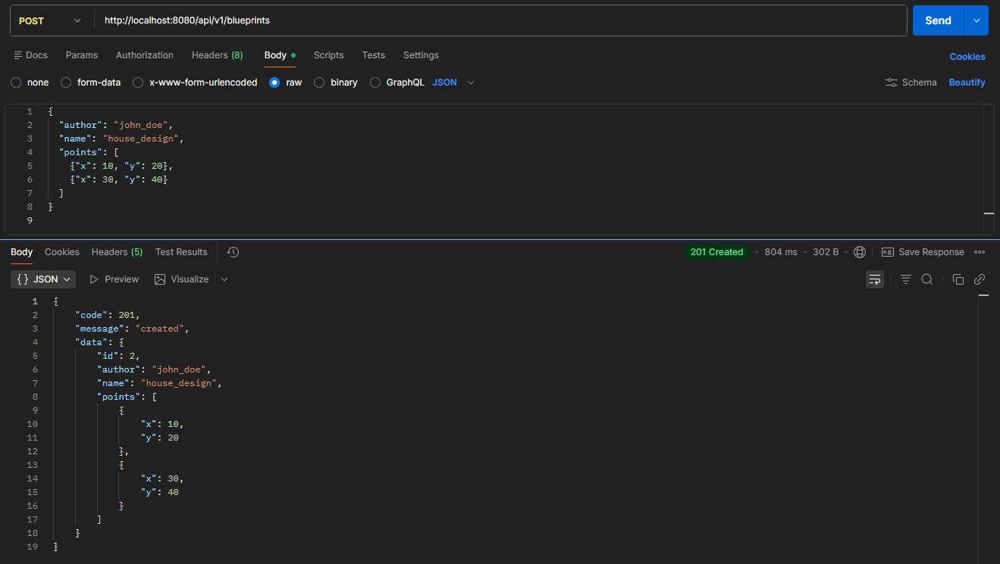
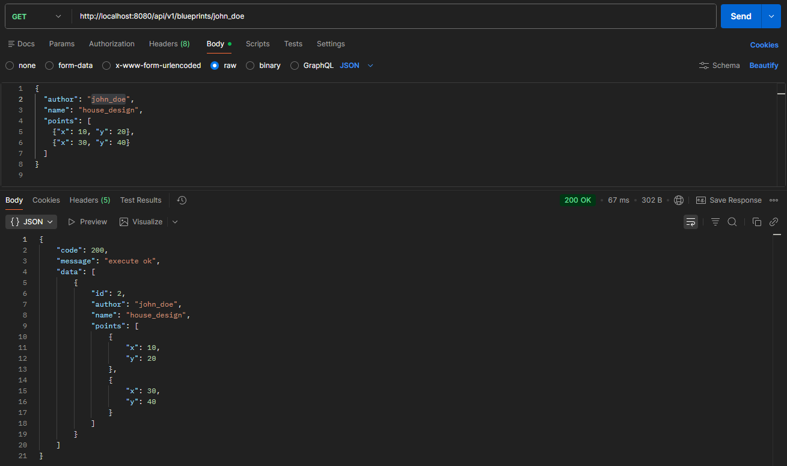
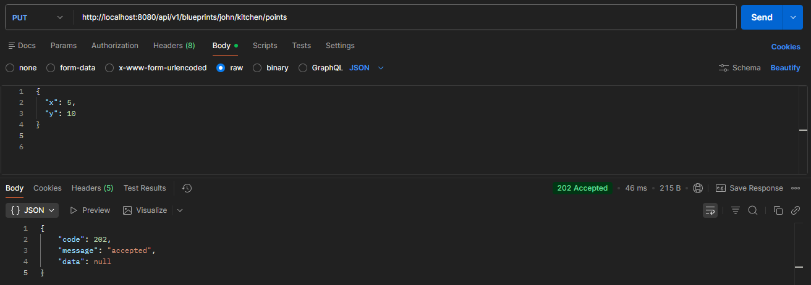
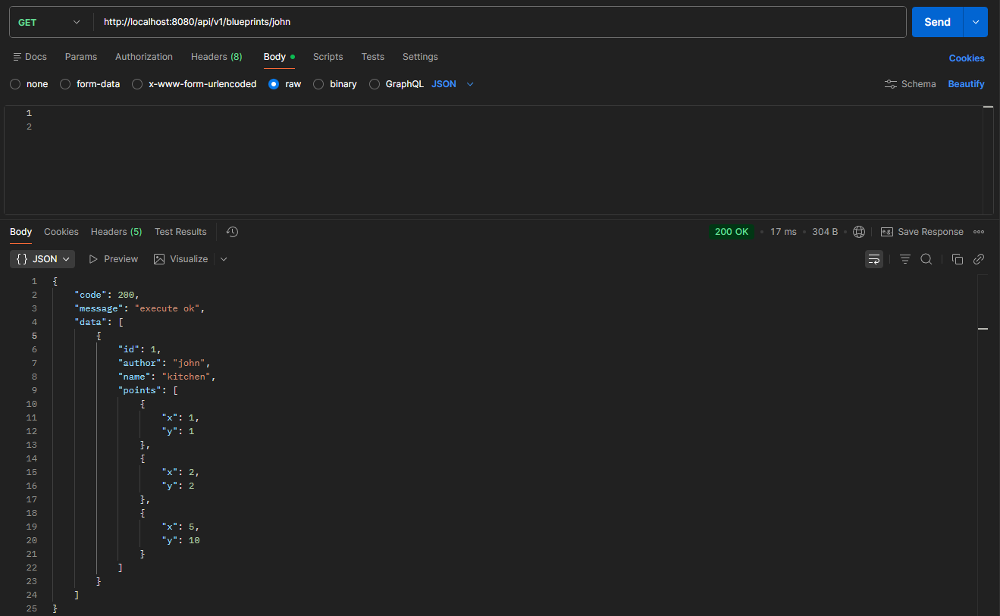
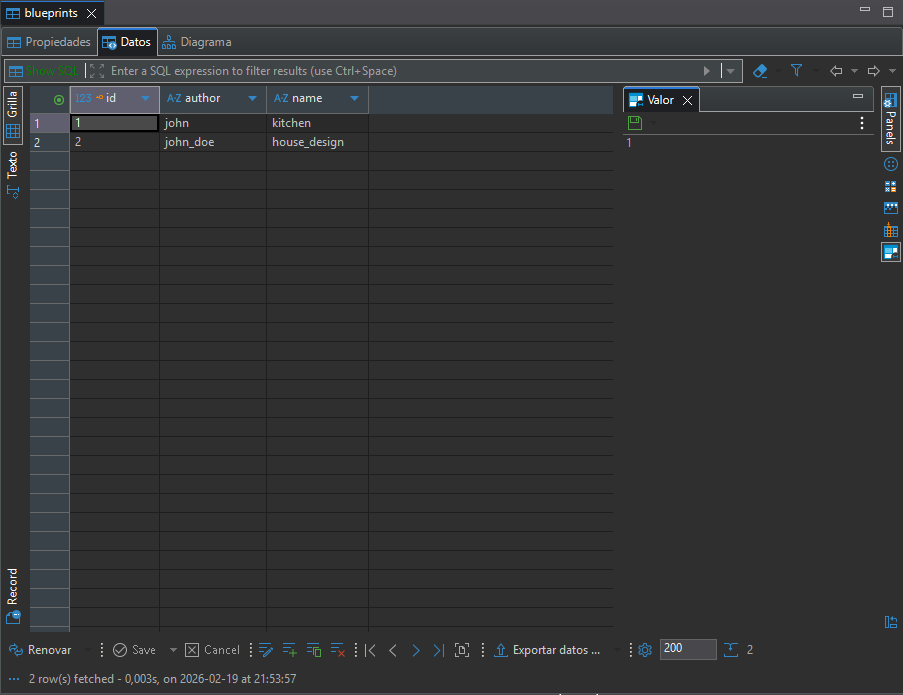
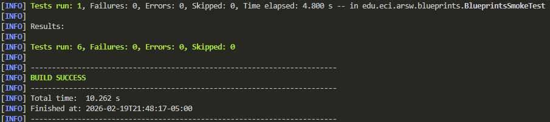

# ARSW LAB 04 - Blueprints REST API

API REST para la gestión de planos (blueprints) desarrollada con Spring Boot 3.3.x, Java 21, PostgreSQL y documentada con OpenAPI/Swagger.

## Tabla de Contenidos

- [Descripción](#descripción)
- [Requisitos Previos](#requisitos-previos)
- [Instalación y Ejecución](#instalación-y-ejecución)
- [Documentación de la API](#documentación-de-la-api)
- [Evidencias de Pruebas](#evidencias-de-pruebas)
- [Buenas Prácticas Aplicadas](#buenas-prácticas-aplicadas)
- [Tecnologías Utilizadas](#tecnologías-utilizadas)

---

## Descripción

Este proyecto implementa una API REST completa para la gestión de blueprints (planos), permitiendo:

- Crear, consultar y modificar blueprints
- Asociar blueprints a autores
- Agregar puntos a blueprints existentes
- Aplicar filtros
- Persistencia en base de datos PostgreSQL
- Documentación con Swagger UI

---

## Requisitos Previos

Tener instalado:

- **Java 21**
- **Maven 3.8+**
- **Docker**

---

## Instalación y Ejecución

1. **Clone el repositorio**

```bash
git clone https://github.com/sebasPuentes/ARSW-LAB04-API
cd ARSW-LAB04-API
```

2. **Inicie la aplicación con Docker Compose**

```bash
docker-compose up -d
```

Este comando:
- Construye la imagen de la aplicación
- Inicia un contenedor de PostgreSQL
- Inicia la aplicación Spring Boot
- Expone la API en `http://localhost:8080`

3. **Verifique que los contenedores estén corriendo**

```bash
docker-compose ps
```
---

## Documentación de la API

### Acceso a Swagger UI

Una vez iniciada la aplicación, acceda a la documentación:

**URL:** `http://localhost:8080/swagger-ui.html`

Swagger UI nos permite:
- Visualizar todos los endpoints disponibles
- Probar las operaciones directamente desde el navegador
- Revisar códigos de estado HTTP y descripciones

### Endpoints Disponibles

| Método | Endpoint | Descripción |
|--------|----------|-------------|
| GET | `/api/v1/blueprints` | Obtener todos los blueprints |
| GET | `/api/v1/blueprints/{author}` | Obtener blueprints por autor |
| GET | `/api/v1/blueprints/{author}/{bpname}` | Obtener un blueprint específico |
| POST | `/api/v1/blueprints` | Crear un nuevo blueprint |
| PUT | `/api/v1/blueprints/{author}/{bpname}/points` | Agregar punto a un blueprint |

---

## Evidencias de Pruebas

### Consultas

#### 1. POST - Crear un nuevo blueprint

**Descripción:** Creación de un blueprint con autor, nombre y conjunto de puntos.

**Ejemplo:**
```json
{
  "author": "john_doe",
  "name": "house_design",
  "points": [
    {"x": 10, "y": 20},
    {"x": 30, "y": 40}
  ]
}
```



#### 2. GET - Obtener blueprints por autor

**Descripción:** Consulta que filtra blueprints según el autor especificado.



#### 3. GET - Obtener todos los blueprints

**Descripción:** Consulta que retorna todos los blueprints almacenados en el sistema.


#### 4. PUT - Agregar punto a un blueprint existente

**Descripción:** Adición de un nuevo punto a un blueprint previamente creado.



Hacemos una peticion GET al punto modificado:



---

### Verificación en Base de Datos

#### Conexión a PostgreSQL

Para verificar la persistencia de datos, puede usar DBeaver.



---

## Buenas Prácticas Aplicadas

### 1. Documentación con OpenAPI/Swagger

Uso de anotaciones `@Operation`y `@ApiResponse` para:
- Documentar cada endpoint
- Describir parámetros y respuestas esperadas

### 2. Repository

Uso de interfaces de persistencia (`JpaRepository`):

- `PostgresBlueprintPersistence` para la base de datos con métodos predefinidos como `save`.

### 3. Inyección de Dependencias

Inyección por constructor:
```java
public BlueprintsAPIController(BlueprintsServices services) {
    this.services = services;
}
```
Facilitando testing, acoplamiento y mantenibilidad.

### 4. Containerización

Uso de Docker para:
- Entorno reproducible
- Fácil despliegue
- Gestión simplificada de PostgreSQL

---

### Pruebas

Evidencia:



---

## Tecnologías Utilizadas

- **Spring Boot 3.3.9** - Framework
- **Java 21** - Lenguaje de programación
- **Maven** - Gestión de dependencias y build
- **PostgreSQL** - Base de datos relacional
- **Spring Data JPA** - Capa de persistencia
- **SpringDoc OpenAPI 2.6.0** - Documentación API (Swagger)
- **Docker** - Containerización

---

## Autor

**Juan Sebastian Puentes Julio**

---

**ARSW - Arquitecturas de Software**

**Escuela Colombiana de Ingeniería Julio Garavito**

